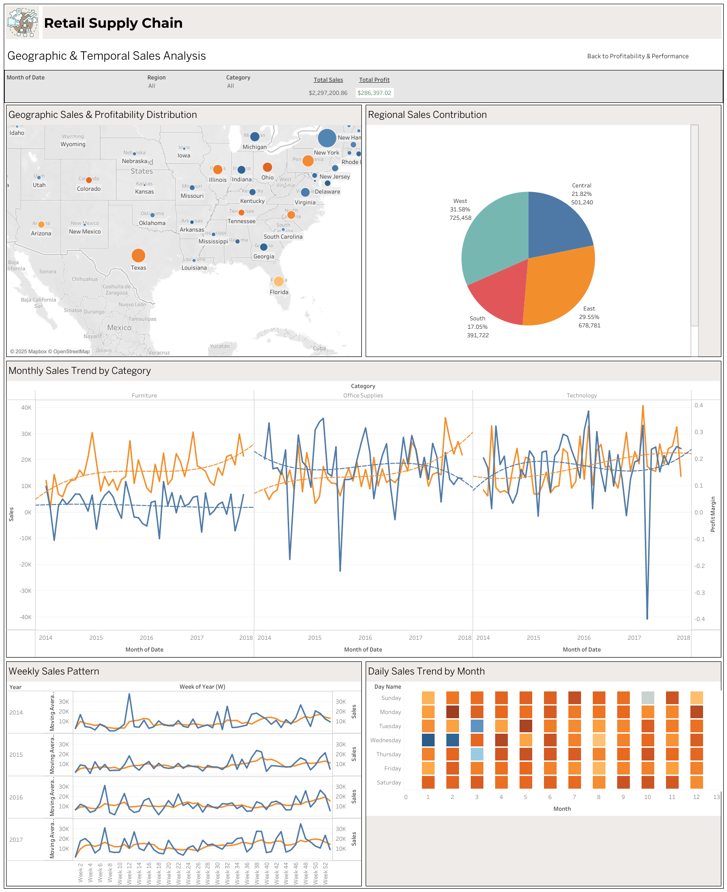

# 📊 Retail Sales & Profitability Dashboard Portfolio  

## 1. Project Overview  
This project focuses on analyzing **retail sales and profitability** using **Tableau** and **Looker Studio**. The analysis aims to:  
- Evaluate sales performance and profit margin across regions, categories, and products.  
- Identify customer purchasing trends and product preferences.  
- Study the impact of geographic and temporal factors (time and region) on sales.  

## 2. Tools Used  
- **Tableau** → for interactive dashboard visualization with advanced filtering and drill-downs.  
- **Looker Studio** → for easy-to-share online dashboards.  
- **Dataset** → [Retail Supply Chain Sales Dataset](https://docs.google.com/spreadsheets/d/1CpxUQ4y7oCDnaoCiv0iH52LxfKRlat60wkA-xYygWUQ/edit?usp=sharing).  

## 3. Dashboards  

### 🔹 Tableau Dashboard – *Retail Sales & Profitability*  
- Sales & Profit Margin by State  
- Sales Trend by Category per Month  
- Profit vs. Discount Analysis  
- Performance of Sub-category  
- Top Returned vs Non-Returned Products (Quantity & Return Rate)  
- Sales Contribution by Region  
- Top Retail Sales People  
- Weekly Seasonality & Day of Week Patterns  

**Screenshot:**  
  

[👉 View Interactive Tableau Dashboard](https://public.tableau.com/app/profile/vitta.margaret.sinambela/viz/RetailSupplyChain_17560046679170/GeographicTemporalSalesAnalysis?publish=yes)  

---

### 🔹 Looker Studio Dashboard – *Retail Sales & Profitability*  
- Total Sales & Profit Overview  
- Sales & Profit Trend Over Time  
- Sales Contribution by Category & Sub-category  
- Geographic Sales Distribution  
- Returned vs Non-Returned Products  
- Customer Purchase Patterns by Day & Week  

**Screenshot:**  
  

[👉 View Interactive Looker Studio Dashboard](https://lookerstudio.google.com/u/0/reporting/edb06f87-3fb1-4cd1-9c86-e047bb5b59ff/page/d0fVF)  

---

## 4. Key Insights  
1. **Profitability varies significantly across regions and categories.**  
2. **Discounts do not always increase profit**, in fact, high discounts often reduce profitability.  
3. **Technology products** drive the highest sales, while **Furniture** has inconsistent profitability.  
4. **Certain sub-categories like Binders & Tables** contribute to higher return rates.  
5. **Weekly and daily seasonality** show clear demand peaks, useful for marketing and inventory planning.  

---

## 5. How to Reproduce  
1. Download the dataset ([Retail Supply Chain Sales Dataset](https://docs.google.com/spreadsheets/d/1CpxUQ4y7oCDnaoCiv0iH52LxfKRlat60wkA-xYygWUQ/edit?usp=sharing)).  
2. Open in Tableau / Looker Studio.  
3. Connect data and apply the dashboard layout provided. 
